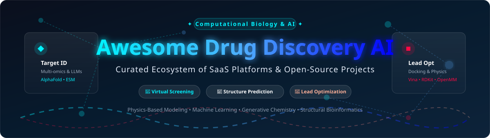

# Awesome-Drug-Discovery-AI 🧪💊

  

  
  
  
  
  

## 📌 Top AI-Driven Drug Discovery Ecosystem & Computational Chemistry Tools

> **A Curated List of Commercial SaaS Platforms & Open-Source GitHub Projects**  
> *Focused on Artificial Intelligence in Drug Discovery, Computational Chemistry, Protein Structure Prediction, Molecular Docking, Virtual Screening & AI-Driven Lead Optimization.*  
> **Last updated: September 2026**

---

This repository tracks notable **SaaS platforms** and **open-source projects** for **AI-Driven Drug Discovery**. These tools apply machine learning (ML), deep learning (DL), physics-based modeling, generative AI, and protein language models (pLLMs) to accelerate the identification of novel therapeutic candidates — from target validation through lead optimization — drastically reducing the time and cost of traditional R&D cycles.

- 🏢 **SaaS Platform Leaders**: Schrödinger, XtalPi, Insilico Medicine, Relay Therapeutics, Schrödinger, Recursion, Valo Health, Owkin, Exscientia, BenevolentAI, Atomwise.
- 💻 **Open-Source Stacks**: AlphaFold, ESM, DeepChem, RDKit, PyMOL, AutoDock Vina, OpenMM, OpenFold, Chemprop, MDAnalysis, DeepPurpose, MDTraj, GNINA, PLIP, ODDT, Open Force Field.

Contributions welcome! Open a PR to add or update entries. Please keep descriptions factual and link directly to official sites/repositories.

---

## 📑 Table of Contents

- [📊 Market Dynamics & Industry Overview](#-market-dynamics--industry-overview)
- [🏢 SaaS & Commercial Hosted Platforms](#-saas--commercial-hosted-platforms)
- [💻 Open-Source GitHub Projects](#-open-source-github-projects)
- [🤝 How to Contribute](#-how-to-contribute)
- [⚠️ Disclaimer](#%EF%B8%8F-disclaimer)
- [☕ Support & Community](#-support--community)
- [📈 Star History](#-star-history)

---

## 📊 Market Dynamics & Industry Overview

> 💡 **Market Size & Structure**: As of 2026, the global **AI in Drug Discovery Market** is estimated at **$3.24 Billion - $5.09 Billion**, growing at a compound annual growth rate (CAGR) of **24.5% - 29.8%**. The sector is **highly fragmented**, with no single enterprise dominating the full pipeline; top market players account for roughly 28%–35% combined market share, operating alongside a long tail of 200+ specialized TechBio startups and academic spinoffs collaborating with global pharmaceutical leaders.

---

## 🏢 SaaS & Commercial Hosted Platforms

The commercial landscape features platforms that combine proprietary multi-omics data, automated robotic wet-lab infrastructure, high-performance physics-based simulations, and fine-tuned biological foundation models.

*Sorted by Company Valuation / Market Capitalization (Descending)* ⬇️

| Platform 🌐 | Enterprise Size / Valuation 💰 | Starting Pricing Tier 🏷️ | Free Tier / Trial Limit 🎁 | Description & Core Focus 🔍 |
| :--- | :--- | :--- | :--- | :--- |
| **[XtalPi](https://www.xtalpi.com/)** | **~$4.25 Billion** (Market Cap) | ~$50,000 / enterprise module engagement | 14-day enterprise trial upon institutional approval | AI & robotics-driven R&D platform with **PepiX™** for peptide discovery and dynamic conformation modeling via quantum physics algorithms. |
| **[Insilico Medicine](https://insilico.com/)** | **~$4.16 Billion** (Valuation) | ~$3,000 / month (Pharma.AI module tier) | 7-day free trial on PandaOmics & Chemistry42 (limited credits) | Clinical-stage generative AI drug discovery engine (**Pharma.AI**) spanning target discovery, generative chemistry, and clinical outcome prediction. |
| **[Relay Therapeutics](https://www.relaytx.com/)** | **~$3.88 Billion** (Market Cap) | ~$100,000 / therapeutic program license | Institutional pilot evaluation (30 days upon request) | **Dynamo®** platform pioneering **Motion-Based Drug Design®** — modeling structural protein dynamics and motion rather than static crystal structures. |
| **[Schrödinger](https://www.schrodinger.com/)** | **~$2.20 Billion** (Market Cap) | ~$10,000 / annual seat license | 30-day evaluation license for academic & commercial R&D | Industry-standard physics-based computational platform with **Bunsen** (AI co-scientist) and **RetroSynth** for AI synthesis planning. |
| **[Recursion](https://www.recursion.com/)** | **~$1.98 Billion** (Market Cap) | Custom Enterprise Partnership ($250k+ milestone tier) | Free access to open datasets & public portal APIs | **Recursion OS** operating at petabyte scale, combining automated phenomics, transcriptomics, and wet-lab automated experiment loops. |
| **[Valo Health](https://www.valohealth.com/)** | **~$1.50 Billion** (Valuation) | Custom Enterprise R&D Tier | Demo sandbox access for qualified pharma partners | Human causal biology platform leveraging 17M+ longitudinal patient records and **Closed Loop Chemistry** screening trillions of compounds. |
| **[Owkin](https://www.owkin.com/)** | **~$1.00 Billion** (Valuation) | ~$5,000 / month per project seat | 14-day free pilot access to Owkin Studio | Agentic AI platform powered by **Owkin Zero** (biological LLM) and **K Pro** co-pilot for accelerated target positioning and patient stratification. |
| **[Exscientia](https://www.exscientia.ai/)** | **~$630 Million** (Market Cap) | Custom Enterprise Collaboration ($150k+ upfront) | Request-based research pilot program (14 days) | Precision medicine platform integrating patient tissue multi-omics and active learning machine learning for targeted small molecule design. |
| **[BenevolentAI](https://www.benevolent.com/)** | **~$350 Million** (Valuation) | Custom SaaS Enterprise License | 14-day trial of Benevolent Platform™ for target discovery | Proprietary **Benevolent Platform™** featuring **R2E (Retrieve to Explain)** for explainable AI target identification and biomedical knowledge graphs. |
| **[Atomwise](https://www.atomwise.com/)** | **~$122 Million** (Valuation) | $2,500 per target screening run | Free academic virtual screening program (1 target run free) | Deep learning virtual screening pioneer powered by **AtomNet**, screening 16-billion synthesis-on-demand chemical libraries. |

---

## 💻 Open-Source GitHub Projects

The open-source ecosystem provides essential, transparent, and reproducible tools for molecular representation, structural bioinformatics, docking, and trajectory simulation.

*Sorted by GitHub Stars_Count (Descending)* ⬇️

| Project 📦 | GitHub_Stars ⭐ | Primary License 📄 | Category & Description 🔬 |
| :--- | :--- | :--- | :--- |
| **[AlphaFold](https://github.com/google-deepmind/alphafold)** |  | Apache-2.0 | **Protein Structure Prediction**: Flagship deep learning system by Google DeepMind predicting 3D protein structures with atomic accuracy. |
| **[DeepChem](https://github.com/deepchem/deepchem)** |  | MIT | **Deep Learning Framework**: The leading open-source library for molecular property prediction, virtual screening, and generative chemistry across PyTorch/JAX. |
| **[ESM (Evolutionary Scale Modeling)](https://github.com/facebookresearch/esm)** |  | MIT | **Protein Language Models**: Meta AI's transformer state-of-the-art protein language models (ESM-2, ESMFold) for structure prediction and variant effect modeling. |
| **[RDKit](https://github.com/rdkit/rdkit)** |  | BSD-3-Clause | **Cheminformatics Core**: The foundational C++/Python toolkit for molecular parsing, 2D/3D coordinate generation, fingerprinting, and substructure searching. |
| **[OpenFold](https://github.com/aqlaboratory/openfold)** |  | Apache-2.0 | **Trainable Protein Folding**: Faithfully reproducible PyTorch implementation of AlphaFold2, enabling custom model training and macromolecular fine-tuning. |
| **[Chemprop](https://github.com/chemprop/chemprop)** |  | MIT | **Molecular Property Prediction**: Message passing neural network (D-MPNN) developed at MIT for state-of-the-art property prediction and uncertainty quantification. |
| **[OpenMM](https://github.com/openmm/openmm)** |  | MIT / LGPL | **Molecular Simulation**: High-performance GPU-accelerated toolkit for molecular dynamics simulation and physics-based drug optimization. |
| **[PyMOL (Open-Source)](https://github.com/schrodinger/pymol-open-source)** |  | BSD-like | **Molecular Visualization**: Standard structural biology tool for rendering, analyzing, and inspecting 3D macromolecular structures and ligand complexes. |
| **[MDAnalysis](https://github.com/MDAnalysis/mdanalysis)** |  | GPL-3.0 | **Trajectory Analysis**: Object-oriented Python library for analyzing molecular dynamics trajectories across a wide range of simulation file formats. |
| **[Open Babel](https://github.com/openbabel/openbabel)** |  | GPL-2.0 | **Chemical File Conversion**: Chemical toolbox interconverting 110+ molecular file formats, generating conformers, and performing basic informatics. |
| **[DeepPurpose](https://github.com/kexinhuang12345/DeepPurpose)** |  | MIT | **Drug-Target Interaction**: Deep learning library containing 15+ compound/protein encoders for binding affinity prediction and drug repurposing. |
| **[AutoDock Vina](https://github.com/ccsb-scripps/AutoDock-Vina)** |  | Apache-2.0 | **Molecular Docking**: The world's most widely cited open-source docking engine developed at Scripps for protein-ligand screening. |
| **[GNINA](https://github.com/gnina/gnina)** |  | Apache-2.0 | **Deep Learning Docking**: Molecular docking engine incorporating 3D convolutional neural networks for scoring pose fidelity and binding affinity. |
| **[MDTraj](https://github.com/mdtraj/mdtraj)** |  | LGPL-2.1 | **Fast Trajectory Processing**: Modern Python library for fast, memory-efficient analysis of molecular dynamics trajectory data. |
| **[PLIP](https://github.com/pharmai/plip)** |  | GPL-2.0 | **Interaction Profiler**: Automated engine for analyzing non-covalent protein-ligand interactions (hydrogen bonds, pi-stacking, salt bridges) from 3D structures. |
| **[ODDT](https://github.com/oddt/oddt)** |  | BSD-3-Clause | **Virtual Screening Pipeline**: Open Drug Discovery Toolkit providing machine learning scoring functions and virtual screening workflows. |
| **[Open Force Field](https://github.com/openforcefield/openff-toolkit)** |  | MIT | **Molecular Force Fields**: Open, reproducible, and extensible force field parameterization tools for small-molecule drug discovery. |

---

### 🛠️ Open-Source Stack Recommended Architecture

For building custom, vendor-independent AI drug discovery pipelines:
1. **Target Identification & Structure**: Use **AlphaFold** or **ESM / OpenFold** for target structure prediction.
2. **Cheminformatics & Representations**: Use **RDKit** for molecular parsing and descriptor generation.
3. **Property Prediction**: Deploy **DeepChem** or **Chemprop** for affinity, toxicity, and ADME modeling.
4. **Docking & Screening**: Run **AutoDock Vina** or **GNINA** for structure-based virtual screening.
5. **Dynamics & Interaction Profiling**: Conduct physics simulations with **OpenMM** and analyze binding modes with **PLIP** and **MDAnalysis**.

---

## 🤝 How to Contribute

We welcome community contributions! To add a new platform or tool:
1. Fork this repository.
2. Add your entry in alphabetical or appropriate sorted position in `README.md`.
3. Include: Product Name, Direct Link, Star/Price Badge, Pricing/Free Tier details, and a 1–2 sentence objective description.
4. Open a Pull Request with a clear summary of changes.

---

## ⚠️ Disclaimer

- This list is **community-curated** for educational and research purposes — it does not constitute an endorsement.
- All drug discovery tools, software, and predictions must comply with regulatory standards (FDA, EMA, ICH) and require empirical wet-lab validation before clinical research applications.

---

## ☕ Support & Community

If you find this repository helpful for your research, computational chemistry projects, or AI pipelines, please consider supporting the project! 🌟

- ⭐ **Star** this repository to increase visibility.
- 🔀 **Fork** it to build your custom discovery workflows.
- 📢 **Share** it with fellow computational chemists, biophysicists, and AI researchers!

*Made with ❤️ for computational chemists, structural biologists, and AI biopharma engineers.*

---

## 📈 Star History

